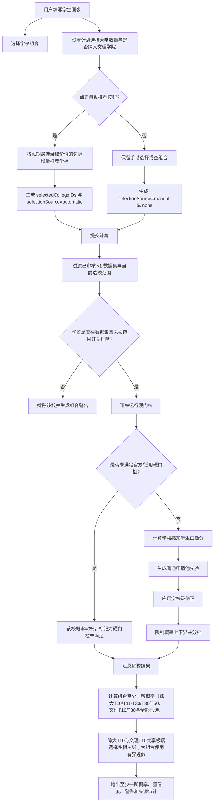
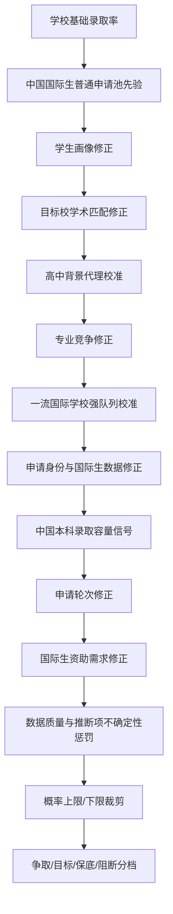

# 录取概率计算流程图

本文档是 `ChanceEngine` 的可解释流程图，方便审查概率路径、UI 文案和测试是否仍与项目契约一致。概率结果是规划估算，不是录取承诺。

## 主流程

## 逐校概率路径

## 用户需要补充的关键信息

这些字段会影响硬门槛、画像分、学术匹配、自动推荐或置信度；缺失时 UI 应提示用户补充或明确采用保守假设。

| 信息 | 影响路径 | 缺失处理 |
| --- | --- | --- |
| 目标学校组合 | 至少一所录取概率、结果页、AI 报告 | 空组合不隐式自动推荐 |
| 是否纳入文理学院 | 自动推荐、手动目录、文理T10/T30与全部已选概率 | 关闭时完全排除文理学院 |
| TOEFL 或 IELTS | 国际生英语硬门槛 | 可能阻断或降低置信度 |
| SAT 或 ACT / Test Optional | 标化硬门槛、画像分、学术匹配 | 选择不提交时忽略残留分数 |
| 课程体系成绩 | 学术画像、目标校学术匹配 | 只转换为内部学术指数，不宣称等同百分制 |
| AP/IB/A-Level/中国课程证据 | 课程体系表现 | 无相关课程证据时不加分 |
| 高中背景 | AdmitRanking 风格代理校准 | 默认使用“其他/手动评估学校”保守代理 |
| 专业方向与作品集 | 艺术路径、专业竞争、作品集门槛 | 艺术方向缺作品集可能直接阻断 |
| 申请轮次 | 官方轮次门槛、轮次修正 | 缺少学校级优势数据时不泛化加成 |
| 国际生资助需求 | 国际生资助政策修正 | 仅对相关国际申请人作为单独因素披露 |

## 自动推荐数量与分档

自动推荐必须由用户点击按钮触发。用户设置一个计划选择大学数量，并通过“纳入文理学院”开关决定候选池；关闭时，自动推荐、手动目录和组合概率都只考虑综合大学。当合格学校数量足够时，自动生成结果数量应与计划数量一致。推荐排序不是只看录取概率，也不是固定按三档配额抽取；每所学校先计算 `单校录取概率 × 排名价值分`，再加入置信度折扣和同层相关性折扣，并按“若获得多个录取，通常选择最高价值 offer”的预期最佳录取价值优化组合。排名价值采用跨类别可比较的固定曲线，但文理学院 T10 对齐到综合大学 T20-T30 价值带，而不是综合大学 T10 价值带。为保证手机端响应速度，精确穷举只用于请求数量较小且组合总空间仍在较小上限内的情况；其余场景优先使用确定性近似，而不是追求最大数学精度。组合空间较大时采用有界快速近似：先按 `概率 × 排名价值分 × 置信度折扣` 排序，并在有界窗口内做边际贪心初选；该窗口额外保留排名价值最高和单校概率最高的少量候选作为护栏，避免高排名学校或高把握学校被大批同层学校挡在窗口外。替换阶段使用同一类有界护栏候选短名单，并优先尝试替换当前组合里边际贡献较低的固定数量学校。只有替换能提高组合最佳录取期望值时才保留；替换试算和最终展示顺位会在当前顺位、边际贪心顺位和排名价值优先顺位之间选择期望值更高者，但不进入无界穷举。这样不会把多个 offer 的排名价值简单相加，也不会把低置信度代理数据学校按同等可靠性推荐，同时避免无上限选校数量导致计算时间过长。模型仍用下列分档解释组合结构：

| 分档 | 概率区间 | 说明 |
| --- | --- | --- |
| 争取 | `0% < p < 20%` | 高风险申请，仍需逐校核对硬门槛 |
| 目标 | `20% <= p < 60%` | 相对匹配，但不代表稳定录取 |
| 保底 | `p >= 60%` | 仅是规划标签，不是录取保证 |
| 阻断 | `p = 0%` | 未满足适用硬门槛 |

若总体可推荐学校不足，系统提示总数缺口。手动选校通过大学目录弹窗完成，不设置人工数量上限。

## T30 组合校准

同层相关性折扣按层级区分：T10 使用更强折扣，非 T10 的综合大学 T30 组合使用较轻但仍保守的折扣。一流国际学校 top10% 中国籍国际生会触发“强队列”校准，用于避免普通中国申请池容量上限把 T11-T30 组合压得过低；该校准不放开 T10 单校容量上限。若申请者选择约 15 所综合大学 T11-T30，且没有硬门槛、资助需求、极端热门专业等重大负面条件，T30 至少一所概率应接近或超过 90%。

综合大学 T10 与文理学院 T10 在“全部已选至少一所”和自动推荐期望值中共享同一个极端选择性相关层。文理学院可以单独显示 T10/T30 至少一所概率，但不能因为类别不同而把顶尖学校当作独立机会相乘。

## 维护清单

概率路径变更时，应同步检查：

- `AdmissionCalculator/Engine/ChanceEngine.swift`
- `AdmissionCalculator/Services/ReportService.swift`
- `AdmissionCalculator/Views/CalculatorView.swift`
- `AdmissionCalculator/Views/ResultsView.swift`
- `AdmissionCalculatorTests/ChanceEngineTests.swift`
- `AdmissionCalculatorTests/HarnessValidationTests.swift`
- `harness.yaml` 与 `HARNESS.md`
