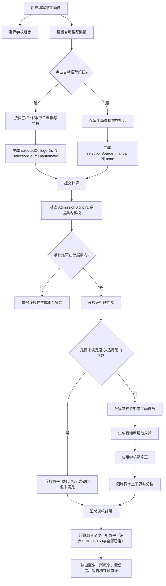
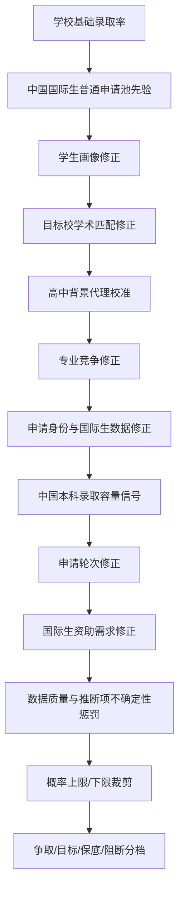

# 录取概率计算流程图

本文档是 `ChanceEngine` 的可解释流程图，方便审查概率路径、UI 文案和测试是否仍与项目契约一致。概率结果是规划估算，不是录取承诺。

## 主流程

## 逐校概率路径

## 用户需要补充的关键信息

这些字段会影响硬门槛、画像分、学术匹配、自动推荐或置信度；缺失时 UI 应提示用户补充或明确采用保守假设。

| 信息 | 影响路径 | 缺失处理 |
| --- | --- | --- |
| 目标学校组合 | 至少一所录取概率、结果页、AI 报告 | 空组合不隐式自动推荐 |
| TOEFL 或 IELTS | 国际生英语硬门槛 | 可能阻断或降低置信度 |
| SAT 或 ACT / Test Optional | 标化硬门槛、画像分、学术匹配 | 选择不提交时忽略残留分数 |
| 课程体系成绩 | 学术画像、目标校学术匹配 | 只转换为内部学术指数，不宣称等同百分制 |
| AP/IB/A-Level/中国课程证据 | 课程体系表现 | 无相关课程证据时不加分 |
| 高中背景 | AdmitRanking 风格代理校准 | 默认使用“其他/手动评估学校”保守代理 |
| 专业方向与作品集 | 艺术路径、专业竞争、作品集门槛 | 艺术方向缺作品集可能直接阻断 |
| 申请轮次 | 官方轮次门槛、轮次修正 | 缺少学校级优势数据时不泛化加成 |
| 国际生资助需求 | 国际生资助政策修正 | 仅对相关国际申请人作为单独因素披露 |

## 自动推荐分档

自动推荐必须由用户点击按钮触发。当前三档阈值为：

| 分档 | 概率区间 | 说明 |
| --- | --- | --- |
| 争取 | `0% < p < 20%` | 高风险申请，仍需逐校核对硬门槛 |
| 目标 | `20% <= p < 60%` | 相对匹配，但不代表稳定录取 |
| 保底 | `p >= 60%` | 仅是规划标签，不是录取保证 |
| 阻断 | `p = 0%` | 未满足适用硬门槛 |

若某一档可推荐学校不足，系统只提示缺口，不从其他档静默填充。

## 维护清单

概率路径变更时，应同步检查：

- `AdmissionCalculator/Engine/ChanceEngine.swift`
- `AdmissionCalculator/Services/ReportService.swift`
- `AdmissionCalculator/Views/CalculatorView.swift`
- `AdmissionCalculator/Views/ResultsView.swift`
- `AdmissionCalculatorTests/ChanceEngineTests.swift`
- `AdmissionCalculatorTests/HarnessValidationTests.swift`
- `harness.yaml` 与 `HARNESS.md`
